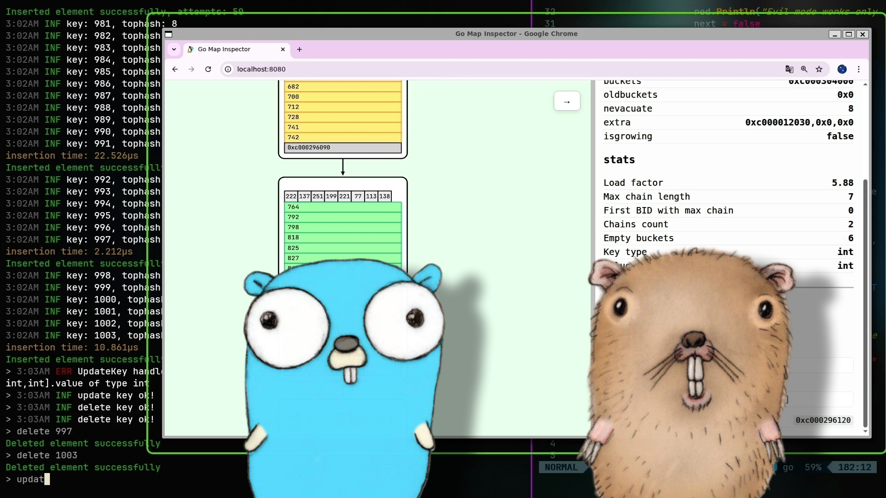

<p align="center">
    
</p>
<p align="center">
    
</p>

## Todo
- [ ] Optimize json updates
- [x] Collision mode ⛓️
- [x] Live mode
- [ ] Docker img (?)
- [x] Сorrect display of ANY types in the visualization
- [x] The ability to perform operations with the map directly from the visualization
- [ ] Implement map visualization for versions >1.23
- [ ] Add an endpoint with an overview of the work of the map (tutorial)
- [ ] I need a good image for the logo

## About Project


This is a simple program that visualizes the inner workings of the hashmap data structure in Golang using the unsafe package. We are talking about the old map (closed hashing) up to and including `version 1.23`. After version 1.23, the map began to work on a completely different principle. Version `1.23.12` was used in testing. You can read the original map code [here](https://cs.opensource.google/go/go/+/release-branch.go1.23:src/runtime/map.go).

## How to install&launch
```shell
git clone https://github.com/hyperocheck/golang-map-visualizer.git
cd golang-map-visualizer
go1.23 run ./cmd/visualizer/
```
## How to use
To set your hash map type, you just need to change the return type inside the anonymous function in the `main` func and, of course, return the map (file: `/cmd/visualizer/main.go`). Inside this anonymous function, you can do whatever you want with the map, for example, fill it with 100_000 elements or delete half of them. Here's what it looks like:
```go
func main() {
	// Create your map here and be sure to return it.
	// You can do anything with the map inside this block.
	// And also don't forget to specify the return type.
	fn := func() map[int]float64 {  // <- TYPE

		m := make(map[int]float64)

		for i := cmd.Flag.From; i < cmf.Flag.To; i++ {
			m[i] = float64(i)
		}

		return m // <- RETURN MAP
	}
	// ------------------------------------

	work(fn)
}
```
Using the `--from` and `--to` flags, you can set the start and end of the iterator (if you want to use it at all).  
`go1.23 run ./cmd/visualizer --from 100 --to 1000`  

### CLI Arguments
Arg | Description
--- | ---
`--from` | Sets the starting point for operations when explicitly called in the code
`--to`   |  Sets the end point for operations when explicitly called in the code
`--spectator` | 	Enables Live Mode: automatic insertion tracking. Requires `--from` and `--to`
`--evil` | 	Enables Collision Attack mode. Requires `--from` and `--to`
`--latency` | 	Sets the output delay(ms). Compatible with `evil` and `spectator` modes

### Visualization Actions
Action |	Description
--- | ---
`Click on a buckets` | 	Displays bucket information in the side menu
`Double-click on an active bucket key` | Displays detailed information about the selected key in the side menu
`Double-click + d` | Deletes the selected key
`Double-click + (change value in side menu) + u` | Updates the selected key with the value entered in the side menu

### Console Commands
Command |	Description
--- | --- 
`show` | Prints all key-value pairs currently in the map
`hmap` | Print hmap structure
`exit` | Shuts down the server and exits the console.
`range <from> <to>` | Loop through the insertion path from `from` to `to`
`insert <k> <v>` | guess
`update <k> <v>` | guess
`delete <k>` | guess
## About custom K&V in map type (map[K]V)
There are two ways to use custom types as keys and values. The __simple__ way is to just create a structure and add json tags to it. Then you will use the cli using the json input format. Something like this:
```go
// --- A SIMPLE WAY TO USE CUSTOM TYPES ---
// Simply create a custom structure with JSON tags. In the CLI, you will enter JSON. F.e.: (map[int]UserCustomDataExample1)
type UserCustomDataExample1 struct {
	I1 int    `json:"i1"`
	I2 int    `json:"i2"`
	S1 []bool `json:"s1`
}
// In the CLI, it will look like this: insert 100 {"i1":10, "i2":42, "s1": [true, false, false]} 
```
And __hard way__. You need to implement the Parse method for it so that you can use cli later. After all, the author can't guess how you want to enter your own structure in the insert command, right?:D For example, you want to use `int` as the key and such an `MyIterestingStruct struct` as the value 
```go
type MyInterestingStuct struct {
    I1 int
    I2 int
    S1 []int
}
```
How can we insert this value into the CLI? For example, you came up with the following input format for this structure: `<int>,<int>;<bool, bool, ...>`  
All that remains is to implement the Parse method for this type, which will accept our string from the CLI as input and convert it into our structure for further serialization.
```go
// --- A HARD WAY TO USE CUSTOM TYPES ---
func (UserCustomDataExample) Parse(s string) (UserCustomDataExample, error) {
	var result UserCustomDataExample

	s = strings.TrimSpace(s)

	// ... parsing your custom input format

	return result, nil
}
```

## Easter eggs 😺
~~If you want to visualize a chain of blocks with a length of at least two, then use this formula to generate a certain number of items in a bucket: `(x * 8) * 0.8125`, x is the number of buckets (any number that is a power of two (min 8) -- 8, 16, 32, 64 ...). It will work on the 10th or 20th attempt, good luck:)~~ Now there is evil mode.

<p align="center">
  <table>
    <tr>
      <td>
        <a href="https://www.youtube.com/watch?v=44ZGJwwsNvE">
          
        </a>
      </td>
    </tr>
  </table>
</p>


